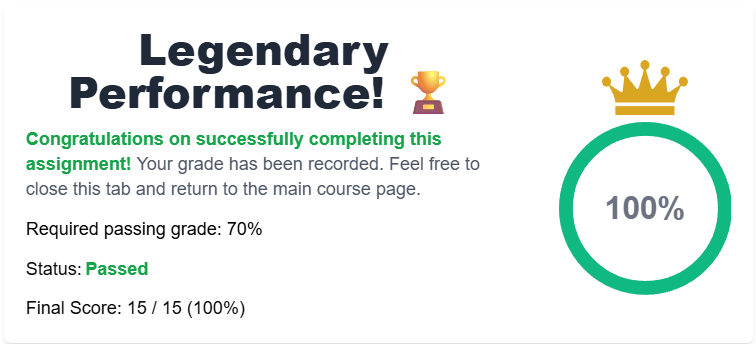

<div align="center">

## ⚠️ Project Notice

> 🤖 **AI-assisted files**  
> `index.html` and this `README.md` were generated with the help of artificial intelligence.
>
> 🧠 **Original work**  
> All other content in this repository — including notebooks, analyses, models, and data — is entirely my own.

---

> 🌐 [View interactive project page](https://Krypt4.github.io/DS_Capstone_Coursera_IBM/)

# 🚀 SpaceX Falcon 9 — Landing Predictor

### IBM Data Science Professional Certificate · Capstone Project

[](https://python.org)
[](https://jupyter.org)
[](https://scikit-learn.org)
[](https://plotly.com)
[](https://coursera.org)

---

*Can the first stage of a Falcon 9 land itself back on Earth?*  
*That question is worth the difference between **\$62M** and **\$165M** per launch.*

---

</div>

## 🎯 Mission Objective

Predict whether the **Falcon 9's first stage booster** will successfully land after a launch — a critical input for estimating the true cost of each mission. The project covers the full Data Science lifecycle: raw data collection, wrangling, SQL + visual EDA, interactive maps, a live dashboard, and a four-model machine learning comparison.

---

## 📡 Launch Sequence

### `01` — Data Collection
> `01_dataCollection/`

| Notebook | Description |
|---|---|
| `01_APICollection.ipynb` | Pulls Falcon 9 launch records from the **official SpaceX REST API** → `dataset_part_1.csv` |
| `02_WebScraping.ipynb` | Scrapes Falcon 9 & Falcon Heavy tables from Wikipedia using **BeautifulSoup** → `wiki_launches.csv` |

---

### `02` — Data Wrangling
> `02_dataWrangling/`

| Notebook | Description |
|---|---|
| `03_DataWrangling.ipynb` | Handles nulls, encodes categoricals, and engineers the target variable **`Class`** (1 = successful landing, 0 = failure) → `dataset_part_2.csv` |

---

### `03` — Exploratory Data Analysis (EDA)
> `03_EDA/`

**SQL Analysis**
- `04_SQL.ipynb` — Success patterns, average payload mass, mission counts per launch site

**Visual Analysis (Seaborn / Matplotlib)**

| Notebook | Analysis |
|---|---|
| 05_01 | Flight Number vs. Launch Site |
| 05_02 | Payload Mass vs. Launch Site |
| 05_03 | Success Rate by Orbit Type |
| 05_04 | Flight Number vs. Orbit Type |
| 05_05 | Payload Mass vs. Orbit Type |
| 05_06 | Yearly Launch Success Trend |
| 05_07–08 | Launch Site Name Exploration |
| 05_09–15 | Payload & Mission Outcome Metrics |
| 05_16–18 | Pie Charts & Success Scatter by Site |

---

### `04` — Interactive Maps & Dashboard
> `04_mapsDashboards/`

| File | Description |
|---|---|
| `06_InteractiveMapsFolium.ipynb` | Marker clusters 🟢 success / 🔴 failure, coastline distance via **Haversine formula** |
| `07_LaunchSiteDashApp.py` | **Plotly Dash App** — filter by launch site, dynamic performance charts |

---

### `05` — Machine Learning
> `05_machineLearning/`

| Notebook | Description |
|---|---|
| `08_MLPrediction.ipynb` | `StandardScaler` normalization, 80/20 split, `GridSearchCV` hyperparameter tuning |
| `09_MLComparison.ipynb` | Accuracy comparison across all four algorithms |
| `10_confusionMatrix.ipynb` | Confusion matrices and final evaluation metrics |

#### 📊 Classification Results

| Model | Accuracy |
|---|:---:|
| Logistic Regression | ~83% |
| Support Vector Machine | ~83% |
| **Decision Tree** | **~89% ✨** |
| K-Nearest Neighbors | ~83% |

> **Decision Tree** achieved the highest accuracy after hyperparameter optimization with `GridSearchCV`.

---

## 🗂️ Repository Structure

```
DS_Capstone_Coursera_IBM/
│
├── 01_dataCollection/
│   ├── 01_APICollection.ipynb      ← SpaceX REST API
│   └── 02_WebScraping.ipynb        ← Wikipedia + BeautifulSoup
│
├── 02_dataWrangling/
│   └── 03_DataWrangling.ipynb      ← cleaning + Class variable
│
├── 03_EDA/
│   ├── 04_SQL.ipynb                ← SQL queries
│   └── 05_01…18_*.ipynb            ← 18 visual analyses
│
├── 04_mapsDashboards/
│   ├── 06_InteractiveMapsFolium.ipynb
│   └── 07_LaunchSiteDashApp.py     ← Dash web app
│
├── 05_machineLearning/
│   ├── 08_MLPrediction.ipynb
│   ├── 09_MLComparison.ipynb
│   └── 10_confusionMatrix.ipynb
│
├── data/
│   ├── dataset_part_1.csv          ← raw API data
│   ├── dataset_part_2.csv          ← cleaned + Class
│   └── wiki_launches.csv           ← scraped data
│
├── examResults/
│   ├── examGrade.png               ← grading screenshot
│   └── AI_GradingFeedback.pdf      ← AI evaluation report
│
└── presentation/
    ├── DS_Capstone_Coursera.pdf
    └── DS_Capstone_Coursera.pptx
```

---

## 🛠️ Tech Stack

| Category | Tools |
|---|---|
| Language | Python 3 |
| Environment | Jupyter Notebooks |
| Data | Pandas, NumPy |
| Visualization | Matplotlib, Seaborn, Plotly |
| Maps & Dashboard | Folium, Plotly Dash |
| Machine Learning | scikit-learn (LogReg, SVM, DT, KNN) |
| Web Scraping | BeautifulSoup, Requests |
| Database | SQL / SQLite |

---

## 📋 Grading

<div align="center">

[](examResults/examGrade.png)

</div>

## 🤖 AI Evaluation Feedback

> 📄 [View AI Grading Report](examResults/AI_GradingFeedback.pdf)

---

<div align="center">

*IBM Data Science Professional Certificate · Coursera · 2026*

</div>
